# Tomaremos como ejemplo este ticket: iSystems#9999083

# SOLICITUD DE RESTAURACION DE BACKUP DEL DIA 02/07/2024-XPLORA-MOUNTAIN LODGE

# Primera Parte

Primero hay que ver si es un Multitenant o single tenant. En este caso el customer en Multitenant.

> Xplora - Mountain Lodge / Multitentant "hanamt.dctpamt090.privatcloud.biz = 10.3.90.2" schame name=SBO_PROD_XH / E11 / isysCLOUD=usbck.privatcloud.biz / isysUSER=isystems_tpa090

Entonces primero debemos ubicar si esta el backup del tenant "E11" en el servidor usbck.privatcloud.biz, y si si esta.

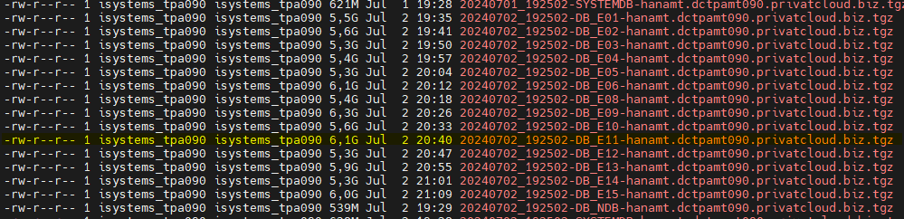

Ahora debemos subir ese archivo `20240702_192502-DB_E11-hanamt.dctpamt090.privatcloud.biz.tgz` al servidor SFTP, es este caso usaremos la ruta: `/Peru/telmo_files` para luego descargarla en otro lado.

```shell
sftp -P 2022 t.suarez@files.privatcloud.biz
# pass: *******************
cd /Peru/telmo_files
put 20240702_192502-DB_E11-hanamt.dctpamt090.privatcloud.biz.tgz
bye
```

**Uploading SFTP**

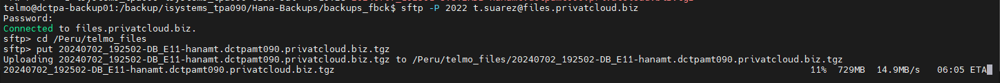

---

# Segunda Parte

Ahora necesitamos usar un HANA para poder restaurar esta base de datos, y luego exportar este schema para poder zipearlo, subirlo al SFTP e importarlo en el entorno que solicitan.

## VM's de Michael

**Michael VM's Power off**

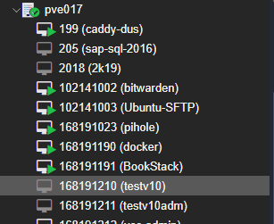

**Michael VM's Power on**

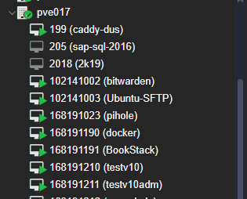

Aqui solo necesitamos conectarnos por SSH al linux y RDP al windows.

Entramos a la maquina windows y vemos si no hay mas bases de datos para crear la que ncesitamos ejecutamos este comando en *SYSTEM@SYSTEMDB* `select * from "SYS"."M_DATABASES";`

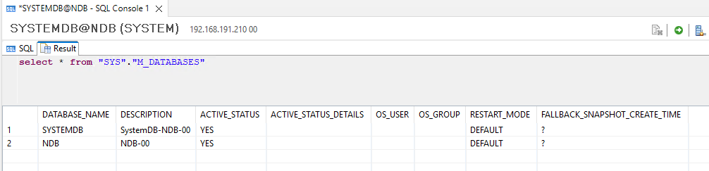

Usaremos como guia el "ServerInstallation en el bookstack" [Sles schema restore](https://bookstack.isystems-integration.com/books/network/page/serverinstallation#bkmrk-sles_hana_schema_res)

1. Primero Crearemos la base de datos con el nombre que necesitamos `CREATE DATABASE E11 ADD 'xsengine' ADD 'scriptserver' SYSTEM USER PASSWORD Test1234;`

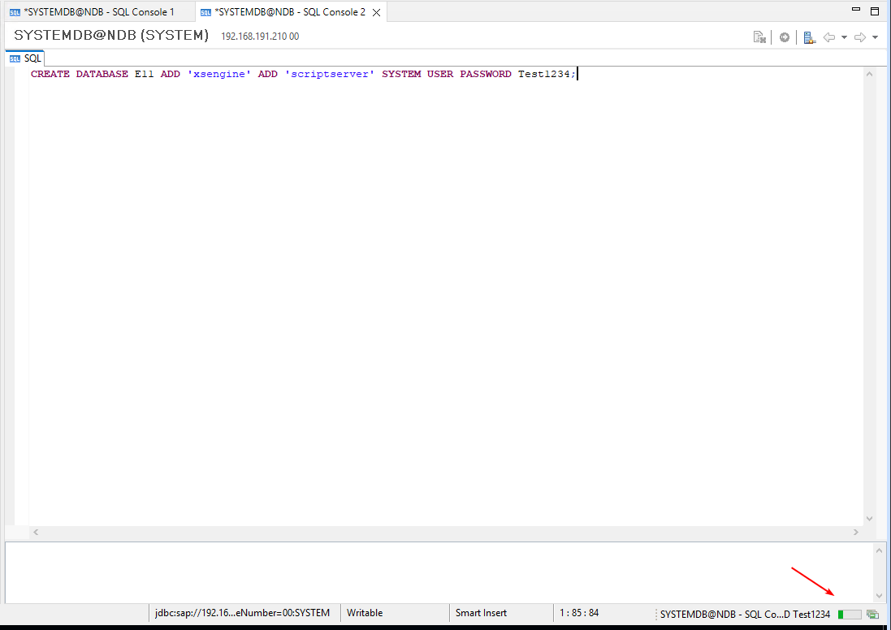

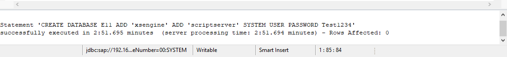

2. Ahora paramos la base de datos para poder restaurarla `ALTER SYSTEM STOP DATABASE E11;`

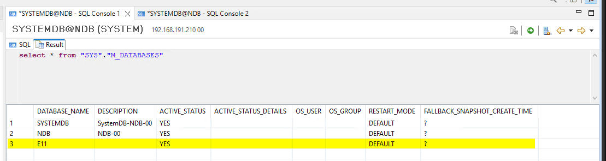

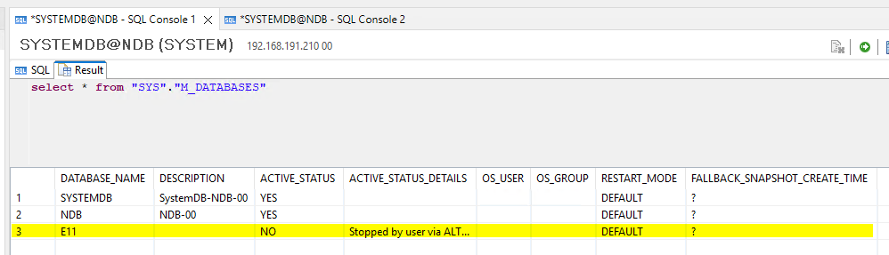

3. Ahora dentro de linux creamos esta ruta "/backup/data/DB_E11/" `mkdir -p /backup/data/DB_E11/` y le damos los permisos que debe tener `cd /backup; chown -R ndbadm:sapsys data/ && cd data/DB_E11/` estando en esa ruta descargamos el archivo aqui:

```shell
sftp -P 2022 t.suarez@files.privatcloud.biz
# pass: *******************
cd /Peru/telmo_files
get 20240702_192502-DB_E11-hanamt.dctpamt090.privatcloud.biz.tgz
bye
tar -xvzf 20240702_192502-DB_E11-hanamt.dctpamt090.privatcloud.biz.tgz
```

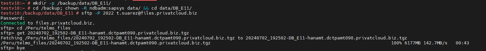

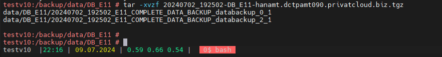

4. Ahora verificamos que tanto las carpetas como los archivos tengan los permisos correctos, luego empezaremos a importar el tenant desde esta ruta, con un query  SQL Query `RECOVER DATA FOR E11 USING FILE ('/backup/data/DB_E11/20240702_192502_E11_COMPLETE_DATA_BACKUP') CLEAR LOG;`

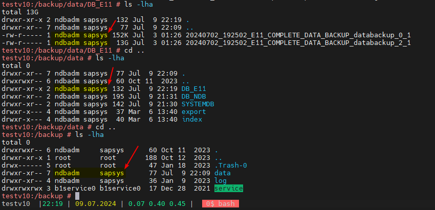cd

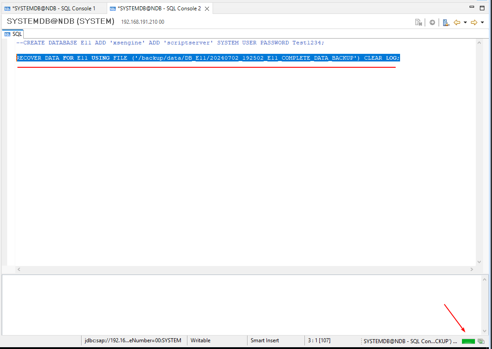

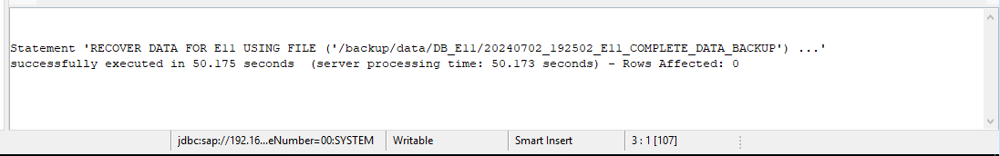

5. Verificar el estado de las base de datos nuevamente `select * from "SYS"."M_DATABASES";` y si el E11 no estuviese iniciado, debemos iniciarlo `ALTER SYSTEM START DATABASE E11;`

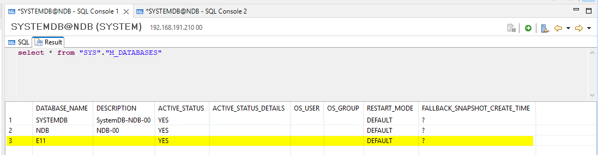

# Tercera Parte

En esta parte debemos exportar es schema que nos piden, zipearlo, subirlo al SFTP e importarlo con el nombre que nos solicitan en el el tenant que corresponde.

Antes de hacer esto para prevenir un error vamos a hacer algo primero, tiene que ver con este SAP Note: 2356350 - Workaround for Exporting/Importing History Table OTQA Since SAP HANA 1.0 SPS 11 and HANA 2.0

Para ello debemos entrar con SYSTEM@E11 y aplicar el siguiente SQLQuery `ALTER SYSTEM ALTER CONFIGURATION ('indexserver.ini', 'system') set ('import_export', 'enable_history_table_import_export') = 'true' with reconfigure;`

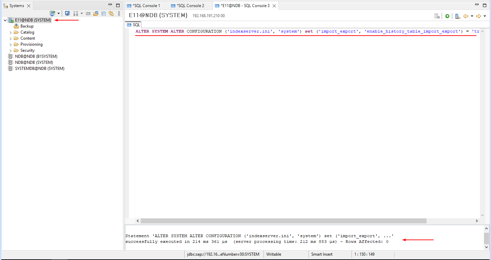

1. Ahora ingresamos al hana system por consola "ssh", y aqui hacemos la exportacion de la base de datos, y la subimos al SFTP Server.

```shell
	#Begining in the hana
	screen -dRR
	cd /tmp && ls -lha
	mkdir dbxa XPA
	chmod -R 777 dbxa/ XPA/
	chown -R ndbadm:sapsys dbxa/ XPA/ && ls -lha
	
	#SQL Varibles (SYSTEM)
	dbSql="/hana/shared/NDB/HDB00/exe/hdbsql"
	dbInstance="00"
	dbHost="127.0.0.1"
	dbTenant="E11"
	dbUser="B1SYSTEM"
	dbPass="n8wg3PQ6nGE4"

	#Test DB
	"$dbSql" -i "$dbInstance" -d "$dbTenant" -n "$dbHost" -u "$dbUser" -p "$dbPass" 'select * from "SYS"."SCHEMAS";'
	
	# Export the schema
	"$dbSql" -i "$dbInstance" -d "$dbTenant" -n "$dbHost" -u "$dbUser" -p "$dbPass" 'export 'SBO_PROD_XH'."*" as binary into '\'/tmp/dbxa\'' with ignore existing threads 10;'

	# Done Export
	[Xplora - MountainLodge]
	0 rows affected (overall time 50.196295 sec; server time 50.195950 sec)

	# Compress schemas ACTON-PinhaldaTorre and save on folder "/acton/pinhaldatorre/saved_schemas"
	tar -C /tmp/dbxa -czf /tmp/XPA/SBO_PROD_XH_07022024.tar.gz ./

	cd /tmp/XPA && ls -lha
	# Upload to the SFTP
	sftp -P 2022 t.suarez@files.privatcloud.biz
	# pass: XvYMFSBE0YOuMFbT41yv
	cd /Peru/telmo_files
	put SBO_PROD_XH_07022024.tar.gz
	bye

	# Delete the non necessary files
	cd /tmp && ls -lha && rm -rf dbxa/ XPA/ && ls -lha
----------------------------------------------------------------------------------------------------------------------------------------
	# Ticket: iSystems#9999083
	# Task: Download the schema called "SBO_PROD_XH_07022024.tar.gz" from the SFTP Server to import in HANA
	# For Xplora - Mountaing Loudge - hanamt - 10.3.90.2
	# Date: 09/07/2024
	# Tenant E11

	screen -dRR
	cd /tmp && ls -lha
	mkdir XPA dbml
	chmod -R 777 XPA/ dbml/
	chown -R ndbadm:sapsys XPA/ dbml/ && ls -lha && cd /tmp/XPA

	# Download from the SFTP
	sftp -P 2022 t.suarez@files.privatcloud.biz
	# pass: XvYMFSBE0YOuMFbT41yv
	cd /Peru/telmo_files
	get SBO_PROD_XH_07022024.tar.gz
	bye

	# extract the tar file into the every folder /tmp/dbvk1 and /tmp/dbvk2
	tar -C /tmp/dbml -xzf /tmp/XPA/SBO_PROD_XH_07022024.tar.gz

	# see the name of the schemas
	ls -lha /tmp/dbml/export    #SBO_PROD_XH
	
	# Mostrar el contenido de una carpeta y guardarla en una variable
	#schema1=$(ls -1 /tmp/dbvk1/export | head -n 1)
	#schema2=$(ls -1 /tmp/dbvk2/export | head -n 1)

	#SQL Varibles (SYSTEM)
	dbSql="/hana/shared/NDB/HDB00/exe/hdbsql"
	dbInstance="00"
	dbHost="127.0.0.1"
	dbTenant="E11"
	dbUser="B1SYSTEM"
	dbPass="n8wg3PQ6nGE4"

	#Test DB
	"$dbSql" -i "$dbInstance" -d "$dbTenant" -n "$dbHost" -u "$dbUser" -p "$dbPass" 'select * from "SYS"."SCHEMAS";'
	
	#import the schema and rename
	"$dbSql" -i "$dbInstance" -d "$dbTenant" -n "$dbHost" -u "$dbUser" -p "$dbPass" 'import 'SBO_PROD_XH'."*" as binary from '\'/tmp/dbml\'' with ignore existing threads 10;'
	"$dbSql" -i "$dbInstance" -d "$dbTenant" -n "$dbHost" -u "$dbUser" -p "$dbPass" 'import 'SBO_PROD_XH'."*" as binary from '\'/tmp/dbml\'' with ignore existing threads 10 rename schema "SBO_PROD_XH" to "SBO_PROD_XH2";'
	
	# Done import the schema
	[Xplora - Mountain Lodge]
	0 rows affected (overall time 49.805236 sec; server time 49.805106 sec)

	# Delete non necessary files
	cd /tmp; ls -lha && rm -rf XPA/ dbml/ && ls -lha
```

2. Y con esto ya hemos importado la base de datos del "02/07/2024" en el entorno "Xplora - Mountain Lodge / DB-E11 / schema=SBO_PROD_XH2"

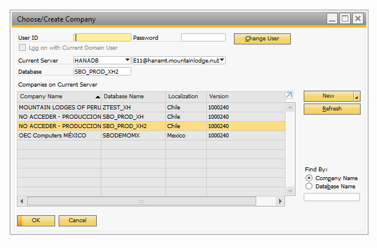

3. Importante al temrinar siempre hacer un rollback al los Snapshots de los VM's de Michael y mantener esas maquinas apagadas.

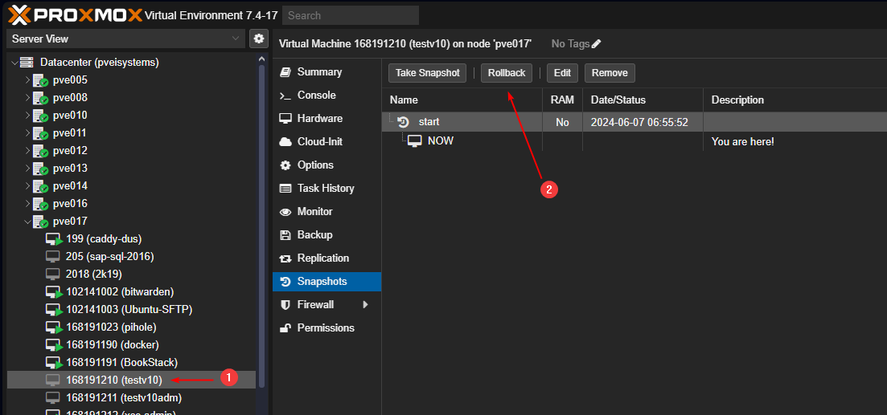

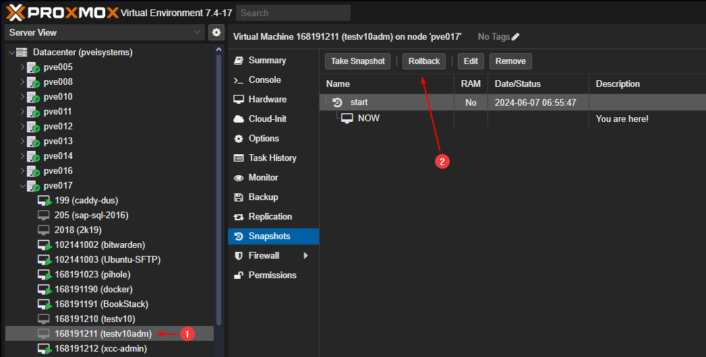

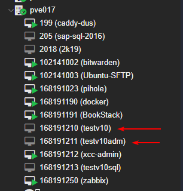